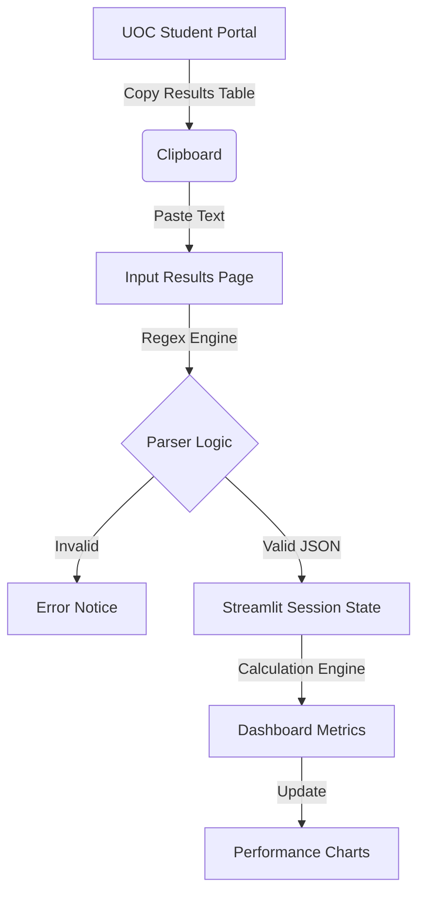
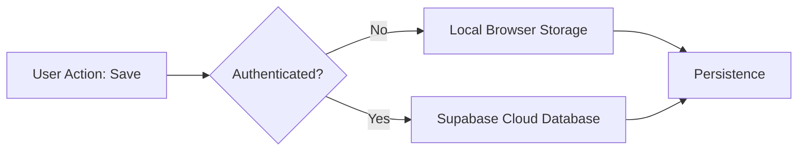
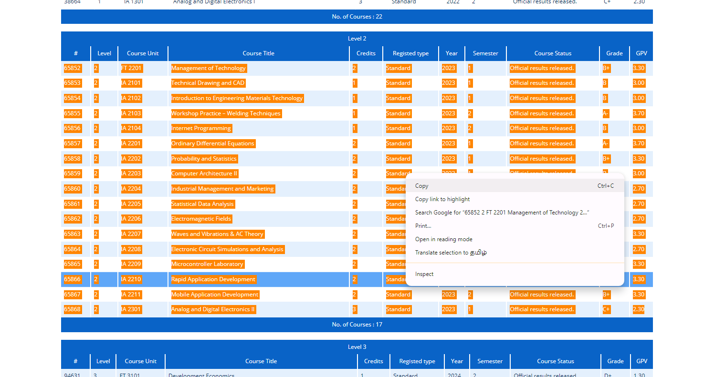

#  Academic Tracker - University of Colombo (UOC)
[][(https://academic-tracker.streamlit.app)](https://abilashgpacalculatoruocfot.streamlit.app/)
[](https://github.com/Abilash-Nickal)

A high-performance, premium GPA tracking dashboard designed specifically for University of Colombo students. This tool provides intelligent result parsing, real-time performance analytics, and cloud-synchronized data storage.

---

##  Demo Video

Check out the demo video to see the Academic Tracker in action:

[](https://youtu.be/kfrPbWMncnc)

---

---

## The Problem

Currently, the **University of Colombo Student Information System (SIS)** does not provide a built-in GPA calculation or tracking feature. As a result:
*   **Manual Effort**: Students are forced to manually type their results into third-party apps or spreadsheets, which is both time-consuming and error-prone.
*   **Limited Availability**: Many previous third-party tools are no longer maintained or accessible.
*   **Poor Visualization**: Existing options lack the detailed performance visualization and strategic planning tools needed for effective academic tracking.

**Academic Tracker** solves this by offering a zero-entry, automated way to visualize your academic journey.

---

##  Key Features

*   **Intelligent Portal Parsing**: Simply copy your results table from the UOC student portal and paste it; the system automatically extracts course codes, titles, credits, and GPVs.
*   **Hybrid Storage System**: 
    *   **Guest Mode**: Saves your data securely in your local browser cache.
    *   **Cloud Sync**: Log in with your Student ID to sync data across devices via a **Supabase** backend.
*   **Strategic Planning**:
    *   **Target Tracker**: Visualize exactly what GPA you need in your remaining credits to reach your goal (First Class, 2nd Upper, etc.).
    *   **Semester Overviews**: Level-by-level performance breakdown with SGPA and credit tallies.
*   **Interactive Data Management**: Edit, reorder, and add custom remarks to your results in the **Master Data** panel.
*   **Direct Feedback**: Integrated feedback form that sends messages directly to the developer's inbox.

---

##  System Architecture

### Data Processing Flow


### Storage Mechanism


---

##  Visual Guide

### 1. Simple Data Import
Copy your table from the portal and paste it directly. No manual entry required!


### 2. Strategic Target Planning
Set your target class (e.g., 2nd Upper) and see your required GPA instantly.


### 3. Comprehensive Semester Breakdown
View level-specific stats and track your growth over time.


---

##  Local Setup

1.  **Clone the Repository**:
    ```bash
    git clone https://github.com/Abilash-Nickal/GPA-Calculator-UOC.git
    cd GPA-Calculator-UOC
    ```

2.  **Install Dependencies**:
    ```bash
    pip install -r requirements.txt
    ```

3.  **Configure Secrets**:
    Create a folder `.streamlit` and a file `secrets.toml` inside it:
    ```toml
    [connections.supabase]
    SUPABASE_URL = "your_project_url"
    SUPABASE_KEY = "your_anon_key"
    ```

4.  **Run the App**:
    ```bash
    streamlit run offline.py
    ```

---

##  License & Contact
Developed with ❤️ by **Abilash**. 
Connect on [LinkedIn](https://www.linkedin.com/in/arumugam-abilashan-6916a2157) or [GitHub](https://github.com/Abilash-Nickal).
